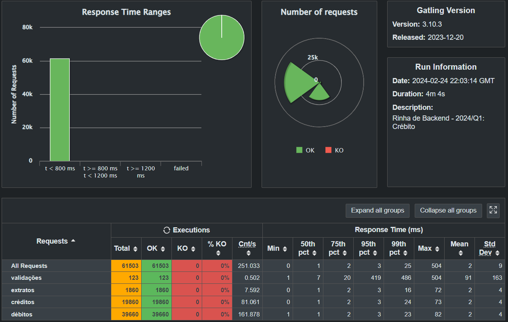

# Rinha de Backend 2ª Edição - aspnet + mongodb

Versão C# com MongoDB da [rinha de backend 2ª edição - 2024/Q1](https://github.com/zanfranceschi/rinha-de-backend-2024-q1)

## Stack

- aspnet core 8
- mongodb
- nginx

## Executando o projeto

```bash
docker compose up api1 api2 nginx
``` 

## Resultados dos testes locais com gatling




## Outras versões da rinha

- [aspnet com EF Core e PostgreSQL](https://github.com/rafaelpadovezi/rinha-2)